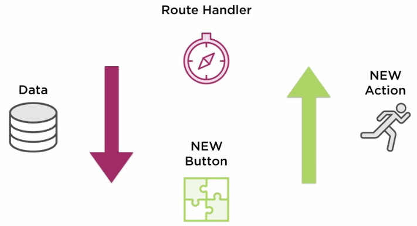
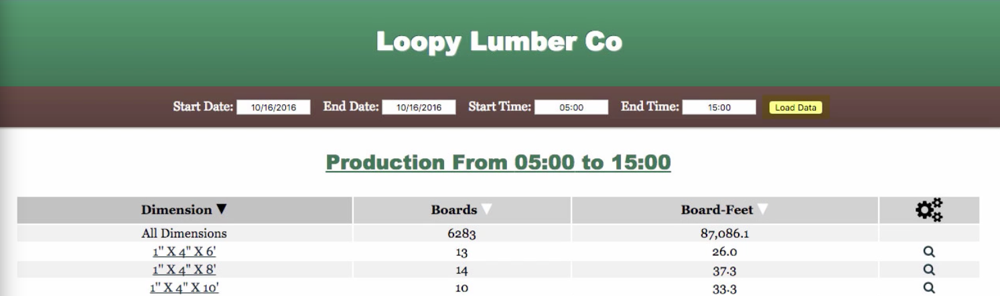
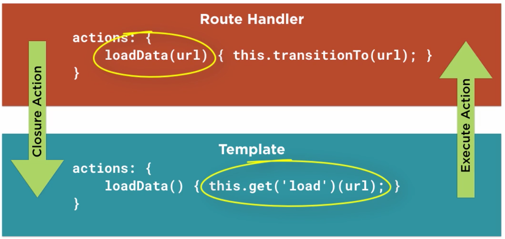
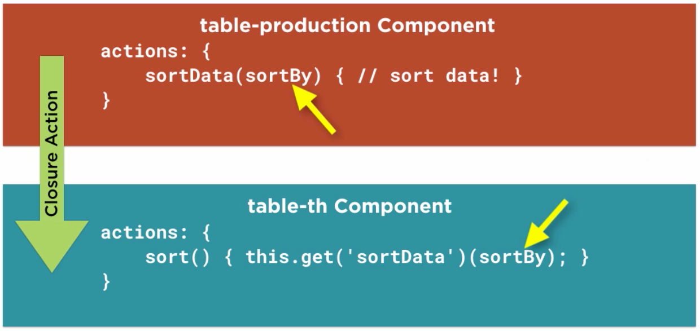

<!-- START doctoc generated TOC please keep comment here to allow auto update -->
<!-- DON'T EDIT THIS SECTION, INSTEAD RE-RUN doctoc TO UPDATE -->
**Table of Contents**  *generated with [DocToc](https://github.com/thlorenz/doctoc)*

- [Getting started with Ember](#getting-started-with-ember)
  - [What is Ember](#what-is-ember)
    - [Ember Core Concepts](#ember-core-concepts)
    - [Ember Definitions](#ember-definitions)
  - [Getting Started](#getting-started)
    - [Setup Your Environment](#setup-your-environment)
    - [Ember CLI](#ember-cli)
    - [Demo: Create a New App](#demo-create-a-new-app)
  - [Routing Incoming Traffic](#routing-incoming-traffic)
    - [Plan Our Application](#plan-our-application)
    - [Generate Base App](#generate-base-app)
    - [Provide a Model](#provide-a-model)
    - [Nested Routes](#nested-routes)
    - [Dynamic Segments](#dynamic-segments)
    - [Index Routes](#index-routes)
    - [Redirecting and Loading](#redirecting-and-loading)
  - [Using Templates Properly](#using-templates-properly)
    - [Handlebars](#handlebars)
    - [Loops and Conditionals](#loops-and-conditionals)
    - [Boolean Attributes](#boolean-attributes)
    - [Named Arguments](#named-arguments)
    - [Create a Helper](#create-a-helper)
    - [Debugging](#debugging)
  - [Getting to Know the Object Model](#getting-to-know-the-object-model)
    - [What is Ember Object](#what-is-ember-object)
    - [Demo: Using Ember Object](#demo-using-ember-object)
    - [Computed Properties](#computed-properties)
    - [Arrays and Controllers](#arrays-and-controllers)
  - [Adding Reusable Components](#adding-reusable-components)
    - [What are Components](#what-are-components)
    - [Controllers no more?](#controllers-no-more)
    - [Using a Component](#using-a-component)
    - [Changing the tagName](#changing-the-tagname)
    - [Handling a Block](#handling-a-block)
  - [Triggering Events & Actions](#triggering-events--actions)
    - [Why Actions?](#why-actions)
    - [Basic Actions](#basic-actions)
    - [Sending Actions](#sending-actions)
    - [More Closure Actions](#more-closure-actions)

<!-- END doctoc generated TOC please keep comment here to allow auto update -->

# Getting started with Ember

> My notes from Pluralsight [course](https://app.pluralsight.com/library/courses/ember-2-getting-started/table-of-contents)

Course is using 2.8.0

## What is Ember

### Ember Core Concepts

- URL centric: URL leads ember state, it comes first, even when transitioning within app
- URL reaches router, which passes request to route handler
- Route handler renders templates and components, and displays resulting page in browser
- Route handler can redirect request to a different route (eg: in the case of faileld authentication)
- Route handler usually loads model, then renders template and displays page
- URL represents state of application, someone should be able to bookmark the page and come back to it exactly as currently shown


### Ember Definitions

***Router*** Maps URL to Route Handler

***Route Handler*** Loads the model and renders the template

***Model*** Represents persistent state (state could reside anywhere such as db, localstorage, etc)

***Templates*** Organize and describe how the interface looks. Should *NOT* contain logic, this will mostly be enforced by Handlebars

***Components*** Control how the interface behaves, using Actions and Events (discussed later)

## Getting Started

### Setup Your Environment

Install Ember-CLI and a few other deps. Course using 2.8.0, but will try latest as of 2019-04-22

```shell
$ npm install -g ember-cli@3.9.0
$ brew install watchman
# Shouldn't need this with Ember 3?
$ npm install -g bower
```

Also install Ember Inspector Chrome extension.

### Ember CLI

- Asset Pipeline for pre-processing, transpiling, and preparing for deployment
- Provides conventional directory structure
- Add-on system for plugins

**Common Commands**

- `ember new <app-name>` Create a new app including dir structure and load deps
- `ember init` Generate app structure in existing dir, used to upgrade existing app to newer ember version
- `ember server` Run dev server, live reload
- `ember generate <name> <opts>` Run code generator to generate some boilerplate code, usually also creates a corresponding test
- `ember install <addon>` Install an add-on + all its deps
- `ember build` Compiles/Builds app for distribution and places in `dist` dir
- `ember test` Run the test suite with `Testem`, can run via CLI or browser

### Demo: Create a New App

Quick overview for now, will go into more detail on each part later.

```shell
$ ember new loopylog
```

- `app` dir contains folders for all the parts of Ember
- `app.js` starts the app
- `router.js` add all your routes here
- `public` dir contains assets such as images, get copied into dist
- `ember-cli-build.js` configuration for asset pipeline

**Directory Structure**

- `app/` Application code, compiled into a single <app-name>.js file
- `dist/` Contains compiled app, ready to deploy
- `public/` Non compiled assets and files, copied verbatim into dist
- `tests/` Unit and integration tests

**app/ Directory Structure**

- `app/app.js` Application code
- `app/index.html` The one and only HTML page, kickstarts app
- `app/router.js` Route configuration
- `app/styles` Stylesheets
- `app/templates` HTMLBars templates and component templates
- `app/<modules>` Modules resolved by Ember CLI (route handlers app/routes, components, models, services, etc.)

Start the app

```shell
$ ember s
```

Open browser at [http://localhost:4200](http://localhost:4200)

Generate application template - layout for entire application

```shell
$ ember g template application
```

Creates empty handlebars template file `loopylog/app/templates/application.hbs`

Note that server auto detects new file and reloads browser.

Edit `application.hbs`:

```hbs
<!-- app/templates/application.hbs -->
<h1>Loopy Lumber Co</h1>
```

Create a new route, recall router and route handler are the first to receive request

```shel
$  ember g route production
installing route
  create app/routes/production.js
  create app/templates/production.hbs
updating router
  add route production
installing route-test
  create tests/unit/routes/production-test.js
```

In `router.js` generator has added:

```javascript
Router.map(function() {
  this.route('production');
});
```

Route handler has been created at `loopylog/app/routes/production.js`

Create link to this new route on home page. Can't use regular html link, instead if `link-to` helper, passing it name of target route. Double curly braces lets handlebars distinguish between expressions and regular html.

```hbs
<!-- loopylog/app/templates/application.hbs -->
{{#link-to "production"}}Production{{/link-to}}
```

`link-to` helper will create a link that transitions to `production` without reloading entire page.

Edit production template with some sample content

```hbs
<!-- loopylog/app/templates/production.hbs -->
<h2>Production</h2>
```

Back in browser, clicking on `Production` link changes url from `localhost:4200` to `localhost:4200/production` but does not change the view displayed, still shows the home page.

This is because we haven't told the application layout where to put the view, use `outlet` helper to specify where a child template should appear.

Application template is parent template of *all* other templates.

```hbs
<!-- loopylog/app/templates/application.hbs -->
<h1>Loopy Lumber Co</h1>

{{#link-to "production"}}Production{{/link-to}}

{{outlet}}
```

Install `pikaday` addon:

```shell
$ ember install ember-pikaday
```

Use `pikaday-input` helper in production template to display a field with datepicker

```hbs
<!-- loopylog/app/templates/production.hbs -->
<h2>Production</h2>

{{pickaday-input format="MM/DD/YYYY"}}
```

Restart server to see it working.

Build production distribution

```shell
$ ember build --environment production
```

Test production version

```shell
$ serve dist
```

## Routing Incoming Traffic

### Plan Our Application

Routes and route structure determined by layout.

For course sampel app, every page has title and footer, which corresponds to Application template. `URL: *`


Production page nested inside Application, contains data input and data, corresponds to Production template. `URL: /production`


Detail route will be nested in Production route -> i.e. Production route will have an Index template.


Data runs from start time to end time, will be reprsented in URL as `/:start/to/:end `so that it can be bookmarked

*Dynamic Segments* Words in url that begin with `:`. Ember parses these and makes them available in route handlers.


Detail view will be underneath production URL with dynamic segment for dimension: `/:start/to/:end/dimension/:dimension_id`


### Generate Base App

Install a few more things:

```shell
$ ember install ember-cli-sass      # css pre-processing
$ ember install ember-cli-bourbon   # sass mixins
$ ember install ember-font-awesome  # icons
```

Update main application template to contain header and main content area

```hbs
<!-- loopylog/app/templates/application.hbs -->
<nav class="title">
  <h1>Loopy Lumber Co</h1>
</nav>

<main>
  {{outlet}}
</main>
```

Delete `loopylog/app/styles/app.css` that came with generated project.

Update `loopylog/app/styles/app.scss` with content from course exercise files.

### Provide a Model

Add model tp production route handler using `model` method:

```javascript
// loopylog/app/routes/production.js
import Route from '@ember/routing/route';

export default Route.extend({
  model() {
    return {
      ProductName: "Ponderosa",
      DimensionName: '1" X 4" x 14"',
      BoardsSum: 20,
      BoardFeetSum: 10000
    }
  }
});
```

Display model attributes in production template using handlebars syntax

```hbs
<!-- loopylog/app/templates/production.hbs -->
<h2>Production</h2>

<p>Product: {{model.ProductName}}</p>
<p>Dimension: {{model.DimensionName}}</p>
<p>Boards: {{model.BoardsSum}}</p>
<p>BoardFeet: {{model.BoardFeetSum}}</p>
```

Now [http://localhost:4200/production](http://localhost:4200/production) displays the model attributes.

But in a real app, would want to retrieve remote data rather than have it hard-coded in the route handler. Will do the a static json data file.

```shell
$ mkdir public/data
```

Copy `production.json` from course exercise files to data dir.

Modify production route handler to use `getJSON` method (course is using jQuery) to retrieve data using an absolute path so it will also work in nested paths.

```javascript
// loopylog/app/routes/production.js
import Route from '@ember/routing/route';
import $ from 'jquery'

export default Route.extend({
  model() {
    //   return {
    //     ProductName: "Ponderosa",
    //     DimensionName: '1" X 4" x 14"',
    //     BoardsSum: 20,
    //     BoardFeetSum: 10000
    //   }
    return $.getJSON('/data/production.json')
  }
});
```

Data is an array so for now, modify template to use array syntax to display 10th item

```hbs
<!-- loopylog/app/templates/production.hbs -->
<h2>Production</h2>

<p>Product: {{model.[10].ProductName}}</p>
<p>Dimension: {{model.[10].DimensionName}}</p>
<p>Boards: {{model.[10].BoardsSum}}</p>
<p>BoardFeet: {{model.[10].BoardFeetSum}}</p>
```

### Nested Routes

Generate route for dimension page, which is nested under production route

```shell
$ ember g route production/dimension
installing route
  create app/routes/production/dimension.js
  create app/templates/production/dimension.hbs
updating router
  add route production/dimension
installing route-test
  create tests/unit/routes/production/dimension-test.js
```

Modify production template to link to dimension route using `link-to` helper. Note route name is `production.dimension`, not `dimension` due to nesting. Ember routes named using dots, not slash.

```hbs
<!-- loopylog/app/templates/production.hbs -->
<h2>Production</h2>

<p>Product: {{model.[10].ProductName}}</p>
<p>Dimension: {{#link-to "production.dimension"}}{{model.[10].DimensionName}}{{/link-to}}</p>
<p>Boards: {{model.[10].BoardsSum}}</p>
<p>BoardFeet: {{model.[10].BoardFeetSum}}</p>
```

To show content for nested dimension route, add `outlet` helper to production template, which is the parent template for dimension child

```hbs
<!-- loopylog/app/templates/production.hbs -->
<h2>Production</h2>

<p>Product: {{model.[10].ProductName}}</p>
<p>Dimension: {{#link-to "production.dimension"}}{{model.[10].DimensionName}}{{/link-to}}</p>
<p>Boards: {{model.[10].BoardsSum}}</p>
<p>BoardFeet: {{model.[10].BoardFeetSum}}</p>

{{outlet}}
```

Modify dimension template just so we can see some content rendering

```hbs
<!-- loopylog/app/templates/production/dimension.hbs -->
<h3>Dimension</h3>
```

### Dynamic Segments

Modify router to add dynamic segments to `production` and `dimension` routes by specifying `path` in options object after route name

```javascript
// loopylog/app/router.js
import EmberRouter from '@ember/routing/router';
import config from './config/environment';

const Router = EmberRouter.extend({
  location: config.locationType,
  rootURL: config.rootURL
});

Router.map(function () {
  this.route('production', {
    path: '/:start/to/:end'
  }, function () {
    this.route('dimension', {
      path: '/dimension/:dimension_id'
    });
  });
});

export default Router;
```

In production route handler, add `params` argument to `model` method and use them in call to static json data

```javascript
// loopylog/app/routes/production.js
import Route from '@ember/routing/route';
import $ from 'jquery'

export default Route.extend({
  model(params) {
    return $.getJSON(`/data/production.json?start=${params.start}&end=${params.end}`)
  }
});
```

In dimension route handler, no need to get json data again because parent route already has it, access via `this.modelFor('production')`. Then use `findBy` model method to find dimension property by `dimension_id` which comes from `params`

```javascript
// loopylog/app/routes/production/dimension.js
import Route from '@ember/routing/route';

export default Route.extend({
  model(params) {
    return this.modelFor('production').findBy('DimensionID', parseInt(params.dimension_id))
  }
});
```

In dimension template, display the dimension details

```hbs
<!-- loopylog/app/templates/production/dimension.hbs -->
<h3>Dimension: {{model.DimensionName}}</h3>
```

Now old production url is broken [http://localhost:4200/production](http://localhost:4200/production) - get a blank page. Due to router changes, there's no longer a path at `/production`, it's now `path: '/:start/to/:end'`. Instead try [http://localhost:4200/yesterday/to/today](http://localhost:4200/yesterday/to/today).

I also had to modify link-to in production template to specify dimension route params, otherwise would not render link. See [link-to ember docs](https://guides.emberjs.com/release/templates/links/) for more details.

```hbs
<!-- loopylog/app/templates/production.hbs -->
<h2>Production</h2>

<p>Product: {{model.[10].ProductName}}</p>
<p>Dimension:
  {{#link-to "production.dimension" model.[10].DimensionID}}{{model.[10].DimensionName}}{{/link-to}}</p>
<p>Boards: {{model.[10].BoardsSum}}</p>
<p>BoardFeet: {{model.[10].BoardFeetSum}}</p>

{{outlet}}
```

### Index Routes

Currently dimension route shows both production and dimension data, but won't work once production route is showing all production etnries.

Notice Ember Inspector Routes view shows `production.index` and `index` routes available


Ember auto assigns a `.index` route to any parent route. It's the default route displayed, for example, when navigating to `production` route.

But there is in `index` template, and yet UI is working. Ember provides blank template for index route by default.

Use index route to display production data - generate production index template:

```shell
$ ember g template production/index
installing template
  create app/templates/production/index.hbs
```

Move model data out of production template to index template

```hbs
<!-- loopylog/app/templates/production/index.hbs -->
<p>Product: {{model.[10].ProductName}}</p>
<p>Dimension:
  {{#link-to "production.dimension" model.[10].DimensionID}}{{model.[10].DimensionName}}{{/link-to}}</p>
<p>Boards: {{model.[10].BoardsSum}}</p>
<p>BoardFeet: {{model.[10].BoardFeetSum}}</p>

<!-- loopylog/app/templates/production.hbs -->
<h2>Production</h2>
{{outlet}}
```

Now dimension page `http://localhost:4200/yesterday/to/today/dimension/11` no longer displaying model data, but production page does `http://localhost:4200/yesterday/to/today/` because its in in the production/index template.

### Redirecting and Loading

Base url of site `http://localhost:4200/` displays nothing. Use redirection to switch to production page using default params `yesterday` and `today`.

Generate index route:

```shell
$ ember g route index
installing route
  create app/routes/index.js
  create app/templates/index.hbs
installing route-test
  create tests/unit/routes/index-test.js
```

In the new index route handler, need to redirect before retriving model, use `beforeModel` method. Use `transitionTo` method passing in route name and as many parameters as the route needs

```javascript
// loopylog/app/routes/index.js
import Route from '@ember/routing/route';

export default Route.extend({
  beforeModel() {
    this.transitionTo('production', 'yesterday', 'tdoay')
  }
});
```

`model` method returns a Promise. While Promise is not resolved, Ember automatically displays `loading` template if it exists. Create a production-loading template

```shell
$ ember g template production-loading
installing template
  create app/templates/production-loading.hbs
```

Put some content in production loading template

```hbs
<!-- loopylog/app/templates/production-loading.hbs -->
LOADING...
```

Refreshing `http://localhost:4200/yesterday/to/tdoay` will show LOADING flashing quickly.

[Loading/Error Substates Ember Docs](https://guides.emberjs.com/v3.8.0/routing/loading-and-error-substates/)

To see the loading state better, modify production route handler to return data from within a Promise with a 2 second timeout

```javascript
// loopylog/app/routes/production.js
import Route from '@ember/routing/route';
import $ from 'jquery'

export default Route.extend({
  model(params) {
    return new Promise((resolve) => {
      setTimeout(() => {
        const data = $.getJSON(`/data/production.json?start=${params.start}&end=${params.end}`)
        resolve(data)
      }, 2000)
    })
  }
});
```

## Using Templates Properly

### Handlebars

- Template structure is intimately tied with routes.
- Templates are executed after route handler and after retrieving a model

**What is Handlebars.js?**

- Implmentation of semantic templates
- Separation of concerns - keep HTML separate from JS
- Handlebars only supports properties inside expressions
- No logic of JS code should be in template
- But it does support expressions, conditional statments, loops
- Can write your own helpers
- GOTCHA: Silent failure (eg: if property call fails) -> designed to be robust, no need to conditionally check for null values when accessing a property of an object. BUT makes it harder to debug
- Uses double curly braces to delimit expressions `{{model.BoardsSum}}`
- Built in helpers, eg: `{{link-to "route"}}Hi!{{/link-to}}`, `{{outlet}}`

### Loops and Conditionals

Edit production index template, use `each` helper to iterate over each model and display its details in a table.

```hbs
<!-- loopylog/app/templates/production/index.hbs -->
<table class="table">
  <thead>
    <tr>
      <th>Dimension</th>
      <th>Boards</th>
      <th>BoardFeet</th>
    </tr>
  </thead>
  <tbody>
    {{#each model as |row|}}
    <tr>
      <td>
        {{#link-to "production.dimensino" row.DimensionID}}
        {{row.DimensionName}}
        {{/link-to}}
      </td>
      <td class="quantity">{{row.BoardsSum}}</td>
      <td class="quantity">{{row.BoardFeetSum}}</td>
    </tr>
    {{/each}}
  </tbody>
</table>
```

Want to add "zero" class to row whenever board count is 0, to make row appear dimmer. This is *binding an attribute* - bind board count to class attribute.

This will NOT work because code like `> 0` is not allowed.

```hbs
<!-- loopylog/app/templates/production/index.hbs -->
{{#if row.BoardsSum > 0}}
<tr>
{{else}}
<tr class="zero">
```

This also won't work because results in unclosed <tr> tag within a block

```hbs
<!-- loopylog/app/templates/production/index.hbs -->
{{#if row.BoardsSum}}
<tr>
  {{else}}
<tr class="zero">
  ```

Solution: Use inline version of `if` helper, has no `#` in front

```hbs
<!-- loopylog/app/templates/production/index.hbs -->
<table class="table">
  <thead>
    <tr>
      <th>Dimension</th>
      <th>Boards</th>
      <th>BoardFeet</th>
    </tr>
  </thead>
  <tbody>
    {{#each model as |row|}}
    {{!-- if BoardsSum is truthy, blank string, otherwise zero --}}
    <tr class="{{if row.BoardsSum "" "zero" }}">
      <td>
        {{#link-to "production.dimension" row.DimensionID}}
        {{row.DimensionName}}
        {{/link-to}}
      </td>
      <td class="quantity">{{row.BoardsSum}}</td>
      <td class="quantity">{{row.BoardFeetSum}}</td>
    </tr>
    {{/each}}
  </tbody>
</table>
```

Now want to apply the `zero` class on any row with 10 boards or less, then can't rely on truthiness. Could provide a calculated value before template renders -> *computed property* (will discuss later), but this is putting view logic where it shouldn't be.

Solution is to use sub expressions (come with Ember) and truth helpers (available via addon).

```shell
$ ember install ember-truth-helpers
# restart ember server
```

Modify template - use parens to create a sub-expression - nesting an expression within another expression.

```hbs
<!-- loopylog/app/templates/production/index.hbs -->
<tbody>
  {{#each model as |row|}}
  <tr class="{{if (gt row.BoardsSum 10) "" "zero" }}">
    <td>
      {{#link-to "production.dimension" row.DimensionID}}
      {{row.DimensionName}}
      {{/link-to}}
    </td>
    <td class="quantity">{{row.BoardsSum}}</td>
    <td class="quantity">{{row.BoardFeetSum}}</td>
  </tr>
  {{/each}}
</tbody>
```

**Additonal Template Notes**

- There's also an `unless` helper that is opposite of `if`.
- When helper expects a block, will begin with hash, eg `{{#each}}` and has closing tag `{{/each}}`
- Inline helper does not use hash

### Boolean Attributes

Special case

Add edit column to boards view with checkbox. To disable checkbox, must provide a boolean value to the `disabled` attribute. Eg, to disable checkbox for rows where BoardsSum is 0:

```hbs
<!-- loopylog/app/templates/production/index.hbs -->
<th>{{fa-icon "cogs"}}</th>
...
<td><input type="checkbox" disabled={{eq row.BoardsSum 0}}></td>
```

### Named Arguments

In addition to regular arguments, helpers can take *named arguments*. To demonstrate, first install an addon that exposes accounting.js library to Ember via helpers:

```shell
$ ember install ember-cli-accounting
# restart server
```

Modify production view,  use format-number helper on BoardFeetSum

```hbs
<!-- loopylog/app/templates/production/index.hbs -->
<td class="quantity">{{format-number row.BoardFeetSum precision=2}}</td>
```

Now BoardFeet column displays with 2 digits of precision.

Named arguments are like optional parameters, provide flexibility.

### Create a Helper

Create a row-class helper to replace current inline conditional `<tr class="{{if (gt row.BoardsSum 10) "" "zero" }}">`. Helper will be re-usable on other pages.

Generate helper using cli

```shell
$ ember g helper row-class
installing helper
  create app/helpers/row-class.js
installing helper-test
  create tests/integration/helpers/row-class-test.js
```

Edit new helper (generator already added necessary boilerplate). Use an array to build a list of classes

```javascript
// loopylog/app/helpers/row-class.js
import {
  helper
} from '@ember/component/helper';

export function rowClass(params /*, hash*/ ) {
  if (params[0]) {
    const row = params[0];
    const class_names = [];
    if (row.Boards === 0 || row.BoardsSum === 0) {
      class_names.push('zero');
    }
    // other conditions can be added here in the future

    return class_names.join(' ');
  }
}

export default helper(rowClass);
```

Modify production template to use new row-class helper instead of conditional, passing in `row` as argument

```hbs
<!-- loopylog/app/templates/production/index.hbs -->
<tr class="{{row-class row}}">
  ```

### Debugging

Suppose template has a typo in property name such as `{{row.DimensioName.length}}` -> Will have NO error on page or in console, just won't display anything.

Handlebars fails silently by design - supports chaining multiple object.prop.prop... without needing null checks.

**Template Debug Helpers**

`log <expressions, variables, primitives>` Output one or many to console, eg:

```hbs
<!-- loopylog/app/templates/production/index.hbs -->
{{log row.DimensioName.length}}
```

Shows `undefined` in Console.

`debugger` Halt execution inside debugger, use `get(var)` to retrieve variables, eg:

```hbs
<!-- loopylog/app/templates/production/index.hbs -->
{{#each model as |row|}}
  ...
  {{debugger}}
  ...
{{/each}}
```


## Getting to Know the Object Model

### What is Ember Object

- Ember has it's own way to do classes `Ember.Object`
- Observation of property value changes
- Templates / computed properties
- Consistent get / set interface
- Class, mixin and constructor methods
- Life cycle hooks
- Extends Array and String

**Extending Ember Object or Another Class**

- Very common in Ember
- `extend` method defines a subclass of either Ember.Object or another existing class
- Inside `extend`, define methods for the class
- Can override parent methods with `this._super`
- Use `this._super` to call the same method in the parent class

```javascript
const Person = Ember.Object.extend({
  say(thing) {
    alert(thing);
    this._super(...arguments);
  }
});

export default Ember.Component.extend({
  classNameBindings: ['isUrgent'], isUrgent: true
});
```

**Initializing a Class Instance**

- `create` method called on class with any starting values -> creates instance of that class
- `init` method invoked automatically, put any default values here

```javascript
const Person = Ember.Object.extend({
  init() {
    alert(`${this.get('name')} reporting for duty`);
  }
});
Person.create({name: 'Elmer Fudd'}); // alert "Elmer Fudd reporting for duty"
```

**Changing Object Properties**

- Ember needs to observe all object properties
- Use `get()` or `set()` to change object properties -> guarantees computed properties get calculated
- For observability on arrays, use `pushObject()`, `removeObject()` etc.

```javascript
const Person = Ember.Object.extend({
  name: 'Elmer Fudd'
});
let p = Person.create();
p.get('name'); // Elmer Fudd
p.set('name', 'Tobias Funke');
p.get('name'); // Tobias Funkey
```

**Computed Properties**

- Declare functions and their dependencies as properties
- Automatically called when asked for or when dependent properties change

```javascript
Person = Ember.Object.extend({
  first: null,
  last: null,
  // fullName is computed property depending on first and last, when they change, fullName changes
  fullName: Ember.computed('first', 'last', function() {
    return `${this.get('first') ${this.get('last')}}`;
  })
});
let ironMan = Person.create({
  first: 'Tony',
  last: 'Stark'
});
ironMan.get('fullName'); // Tony Stark
```

**Computed Property Macros**

- *Macro* Short expressions of common computed properties
- Others include lessThan, greaterThan, min, max etc.

```javascript
Person = Ember.Object.extend({
  name: 'Tony Stark',
  isIronManLongWay: Ember.computed('name', function() {
    return this.get('name') === 'Tony Stark';
  }),
  // Macro, `equal` computed property is equivalent to the long way defined above
  isRonMan: Ember.computed.equal('name', 'Tony Stark')
});
```

### Demo: Using Ember Object

Create a new model - do NOT use generator because don't want to tie it to ember data (will be covered later).

```javascript
// loopylog/app/models/production.js
import EmberObject from '@ember/object'
export default EmberObject.extend({
  // ...
});
```

Modify production route handler to use this model object. Import it, then convert each item of json data to production model:

```javascript
// loopylog/app/routes/production.js
import Route from '@ember/routing/route';
import $ from 'jquery'
import production from '../models/production';

export default Route.extend({
  model(params) {
    return new Promise((resolve) => {
      setTimeout(() => {
        const jsonData = $.getJSON(`/data/production.json?start=${params.start}&end=${params.end}`)
        let records;
        jsonData.then(data => {
          records = data.map(item => production.create(item))
          resolve(records)
        });
      }, 400)
    })
  }
});
```

No change needed to template when changing from regular js object to Ember object. Ember automatically switched to using the `get` methods on Ember object to access properties in the template.

### Computed Properties

Use to make more clear property names from production.json data

```javascript
// loopylog/app/models/production.js
import EmberObject, {
  computed
} from '@ember/object'

export default EmberObject.extend({
  boards: computed('BoardsSum', function () {
    return this.get('BoardsSum');
  })
});
```

Modify template to use computed property

```hbs
{{!-- <td class="quantity">{{row.BoardsSum}}</td> --}}
<td class="quantity">{{row.boards}}</td>
```

Renaming a property is so common, use a macro `alias`

```javascript
import EmberObject, {
  computed
} from '@ember/object'

export default EmberObject.extend({
  boards: computed('BoardsSum', function () {
    return this.get('BoardsSum');
  }),
  boardfeet: computed.alias('BoardFeetSum')
});
```

Computed properties can depend on multiple other properties

### Arrays and Controllers

***As of Ember 2: Components replace Controller, Template and View***

Want to add a totals row above `each` loop in production listing to display total boards and total boards feet

```hbs
<tr class="total">
  <td>All Dimensions</td>
  <td>{{total_boards}}</td>
  <td>{{format-number total}}</td>
</tr>
{{#each model as |row|}}
  ...
{{/each}}
```

Good use for computed properties but total doesn't belong in single production model.

*Controller* Another file that lies between route handler and template.

Kind of like decorator for model. Gets model from route handler. Extends from Ember.Object so also has computed properties. All of controller properties are given to template.


Generate controller

```shell
$ ember g controller production/index
installing controller
  create app/controllers/production/index.js
installing controller-test
  create tests/unit/controllers/production/index-test.js
```

Create `total_boards` property in controller. This depends on the `model` which in the case of production, is the entire array of production model objects.

```javascript
// loopylog/app/controllers/production/index.js
import Controller from '@ember/controller';
import {
  computed
} from '@ember/object';

export default Controller.extend({
  total_boards: computed('model', function () {
    return this.get('model').reduce(function (prev, row) {
      return prev + parseFloat(row.get('boards'));
    }, 0);
  })
});
```

Now production view shows a row with total_boards but PROBLEM - use Ember Inspector -> View Tree -> Click on $E in model column, sends all the model objects to console.

Enter `$E[0]` in console to get reference to first model object.

Try `$E[0].get('boards')` - shows 13.

Now try setting the computed property: `$E[0].set('boards', 15)`

In the UI, the Boards property for that row has been updated but the `total_boards` has not, even though it's computed to be the sum of all the `boards`. This is because controller computed property is based on `model`, not any of its members or properties.

Need to tell `total_boards` computed property to look at `boards` property of each member in `model`.

```javascript
// loopylog/app/controllers/production/index.js
import Controller from '@ember/controller';
import {
  computed
} from '@ember/object';

export default Controller.extend({
  total_boards: computed('model.@each.boards', function () {
    return this.get('model').reduce(function (prev, row) {
      return prev + parseFloat(row.get('boards'));
    }, 0);
  })
});
```

Now repeat console test and notice total is updated.

**Computed Property Macros for Arrays**

First crete property `boardfeets` that is array of all `boardfeet` values from `model`. Updates when any single value changes.

Then create total_boardfeet property, using `computed.sum` macro. Then update `total_boards` property to use same technique:

```javascript
// loopylog/app/controllers/production/index.js
import Controller from '@ember/controller';
import {
  computed
} from '@ember/object';

export default Controller.extend({
  boards: computed.mapBy('model', 'boards'),
  total_boards: computed.sum('boards'),
  max_boards: computed.max('boards'),
  boardfeets: computed.mapBy('model', 'boardfeet'),
  total_boardfeet: computed.sum('boardfeets'),
  max_boardfeet: computed.max('boardfeets')
});
```

## Adding Reusable Components

- Control how the interface behaves.
- Sit between Route Handler and rendered Page
- Template contains HTML - describes how page *looks*
- How to respond to event from HTML? Can't put logic in template
- Code for responding to behaviour belongs in component

### What are Components

- Re-usable chunk of HTML (aka web component)
- Can be used in different places in app
- Can be shared between separate apps
- Conform to W3C Custom Element spec
- Require dash in name
- Have two parts: .js file for behaviour & .hbs file for appearnace
- Isolated by design to support re-use
- Only have access to what is explicitly passed to them - makes it easy to test and debug
- (future) Enforce one way data binding, child component should not be able to modify data passed in unless explicitly permitted

### Controllers no more?

- As of Ember 2, components replace controller/template/view
- Component js file combines behaviour of controller and view, decorating model, and handling events
- Component hbs file is template to describe layout
- Cannot be routed to directly from router? So still need controller/template as target of router
- Will be simpler if/when routable components are brought to Ember, something like this:


### Using a Component

Move production table out of where it currently is in a template, and into a table component.

Generate component

```shell
$ ember g component table-production
installing component
  create app/components/table-production.js
  create app/templates/components/table-production.hbs
installing component-test
  create tests/integration/components/table-production-test.js
```

Copy all table markup from `loopylog/app/templates/production/index.hbs` to `table-production.hbs`

Replace contents of `production/index.hbs` with call to component: `{{table-production}}`

Notice in app, no data is displayed now. Controller/Template receive model automatically, whereas Component is isolated - requires data to be passed in explicitly.

Modify production template to pass in model as *named parameter*

```hbs
<!-- loopylog/app/templates/production/index.hbs -->
{{table-production model=model}}
```

Now production table data is displayed because component has access to model.

BUT still no totals! Component doesn't have access to computed properties that are currently in production controller `loopylog/app/controllers/production/index.js`

Might be tempted to pass each individual needed property into component `{{table-production model=model boards-boards total_boards=total_boards...}}` BUT THIS IS AN ANTI-PATTERN! Makes component harder to re-use.

Solution is to move all computed properties from production controller `loopylog/app/controllers/production/index.js` into js file for component

```javascript
// loopylog/app/components/table-production.js
import Component from '@ember/component';
import {
  computed
} from '@ember/object';

export default Component.extend({
  boards: computed.mapBy('model', 'boards'),
  total_boards: computed.sum('boards'),
  boardfeets: computed.mapBy('model', 'boardfeet'),
  total_boardfeet: computed.sum('boardfeets'),
  max_boardfeet: computed.max('boardfeets')
});
```

Now total row is displaying data in UI.

**Visual Summary**


### Changing the tagName

Looking at generated markup in devtools, table got wrapped in a div:

```html
<div id="ember183" class="ember-view">
  <table class="table">
    ...
  </table>
</div>
```

Ember uses the div id to connect to and track the html.

Having an additional div appear in markup could cause styling issues. To prevent this, add `tagName` property in component js and classNames property with array of all css classes that should be on the tag

```javascript
// loopylog/app/components/table-production.js
import Component from '@ember/component';
import {
  computed
} from '@ember/object';

export default Component.extend({
  tagName: 'table',
  classNames: ['table'],
  boards: computed.mapBy('model', 'boards'),
  total_boards: computed.sum('boards'),
  boardfeets: computed.mapBy('model', 'boardfeet'),
  total_boardfeet: computed.sum('boardfeets'),
  max_boardfeet: computed.max('boardfeets')
});
```

Then modify component template `loopylog/app/templates/components/table-production.hbs` - remove opening and closing table tags since these will now be generated automatically by component.

Now generated markup is:

```html
<table id="ember183" class="table ember-view">
  ...
</table>
```

### Handling a Block

Generate a component that renders a table header cell

```shell
$ ember g component table-th
installing component
  create app/components/table-th.js
  create app/templates/components/table-th.hbs
installing component-test
  create tests/integration/components/table-th-test.js
```

Replace contents of `app/templates/components/table-th.hbs` with a single named expression: `{{name}}`

Specify tag name in component js

```javascript
// app/components/table-th.js
import Component from '@ember/component';
export default Component.extend({
  tagName: 'th'
});
```

Modify table-production template to use this new table-th component, passing in text as named parameter

```hbs
<thead>
  <tr>
    {{table-th name="Dimension"}}
    {{table-th name="Boards"}}
    {{table-th name="BoardFeet"}}
    <th>{{fa-icon "cogs"}}</th>
  </tr>
</thead>
<tbody>
  ...
</tbody>
```

In browser, table still looks as before, but notice table header markup such as `<th id="ember186 class="ember-view">Dimension</th>`

Last table header is trickier to replace with component because it's content is not a simple text, but rather a helper that generates the `cogs` font awesome icon.

Solution is to modify component to accept a block to be evaluated, then it can be used like this

```hbs
<thead>
  <tr>
    {{table-th name="Dimension"}}
    {{table-th name="Boards"}}
    {{table-th name="BoardFeet"}}
    {{#table-th}}{{fa-icon "cogs"}}{{/table-th}}
  </tr>
</thead>
<tbody>
  ...
</tbody>
```

Modify table-th template with `yield` helper, which gives control to block passed in. This in turn will evaluate any content passed in.

```hbs
<!-- loopylog/app/templates/components/table-th.hbs -->
{{yield}}
```

This works in that now icon displays as table header, BUT all the other header rows are broken - not showing the `name` parameter.

Solution to support both named parameter and blocks is to use `if` and `else` helpers in component

```hbs
<!-- loopylog/app/templates/components/table-th.hbs -->
{{#if hasBlock}}
  {{yield}}
{{else}}
  {{name}}
{{/if}}
```

## Triggering Events & Actions

### Why Actions?

- Mechanism for users to interact with controls that change application state
- Need input helpers to get user input for these actions
- Used to control how application behaves

**Data Down Actions Up (DDAU)**

- Data should be loaded in route handlers and passed down to each template and component in hierarchy
- Where to change data or change route? eg: component may need to create new model
- Actions allow this kind of code to run where it needs to be
- Eg: Button component should not know how to create every possible model in app, but it can respond to an event and send action back to code that does know how to handle this



### Basic Actions

Generate a form component for editing a dimension

```shell
$ ember g component form-dimension
installing component
  create app/components/form-dimension.js
  create app/templates/components/form-dimension.hbs
installing component-test
  create tests/integration/components/form-dimension-test.js
```

Modify dimension template to call the new form component, passing in model

```hbs
<!-- loopylog/app/templates/production/dimension.hbs -->
<h3>Dimension: {{model.DimensionName}}</h3>
{{form-dimension model=model}}
```

Add the following markup to the form template and invoke `action` helper passing in "edit" string.

```hbs
<!-- loopylog/app/templates/components/form-dimension.hbs -->
<span class="form">
  <p>Dimension: {{model.DimensionName}}</p>
  <p>Board: {{model.boards}}</p>
  <p>BoardFeet: {{model.boardfeet}}</p>
  <p>
    <span {{action 'edit'}}>{{fa-icon 'pencil'}}</span>
  </p>
</span>
```

`action` heper will call an `edit` action in component when icon is clicked.

To create action, add `actions` property in form copmonent js, define `edit` function in `actions` property

```javascript
// loopylog/app/components/form-dimension.js
import Component from '@ember/component';

export default Component.extend({
  editing: false,
  actions: {
    edit() {
      this.set('editing', true)
    },
    save() {
      // TBD
    },
    cancel() {
      // TBD
    }
  }
});
```

Modify form template to conditonally display based on `editing` prpoerty. If editing, use `input` helper which takes a named parameter `value`, which binds input to whatever is passed in.

```hbs
{{#if editing}}
  <span class="form dirty">
    <p>Dimension: {{input value=model.DimensionName}}</p>
    <p>Board: {{input value=model.boards}}</p>
    <p>BoardFeet: {{input value=model.boardfeet}}</p>
    <p>
      <span {{action 'save'}}>{{fa-icon 'floppy-o'}}</span>
      <span {{action 'cancel'}}>{{fa-icon 'ban'}}</span>
    </p>
  </span>
{{else}}
  <span class="form">
    <p>Dimension: {{model.DimensionName}}</p>
    <p>Board: {{model.boards}}</p>
    <p>BoardFeet: {{model.boardfeet}}</p>
    <p>
      <span {{action 'edit'}}>{{fa-icon 'pencil'}}</span>
    </p>
  </span>
{{/if}}
```

Now the `pencil` icon is clickable, clicking on it will invoke the `edit` action, which in trun sets `editing` property to true, which in turn causes the template the modify its display based on `if/else` helper and display an editable form.

Implement `save` and `cancel` actions in component - just a dummy implementation since we don't have a server to save to

```javascript
// loopylog/app/components/form-dimension.js
import Component from '@ember/component';

export default Component.extend({
  editing: false,
  actions: {
    edit() {
      this.set('editing', true);
    },
    save() {
      //save something to the server
      this.set('editing', false);
    },
    cancel() {
      this.set('editing', false);
    }
  }
});
```

Finally in table production template, replace checkbox with link to product dimension

```hbs
<!-- loopylog/app/templates/components/table-production.hbs -->
...
<td>
  {{#link-to "production.dimension" row.DimensionID}}
    {{fa-icon 'search'}}
  {{/link-to}}
</td>
...
```

### Sending Actions

Implement feature from mockup where user can enter different start/end dates and clikc Load Data to load a new url with a different range of data



Modify production template - add inputs for changing page. Use a form tag specifing action and `on="submit"` because don't want this to happen on click. The `on` named parameter is for setting which DOM event should trigger the action.

```hbs
<!-- loopylog/app/templates/production.hbs -->
<header class="details">
  <span>
    <form {{action "loadData" on="submit"}}>
      <p>Start Date: {{pikaday-input value=start_date format="MM/DD/YYYY"}}</p>
      <p>End Date: {{pikaday-input value=end_date format="MM/DD/YYYY"}}</p>
      <p>Start Time: {{input value=start_time}}</p>
      <p>End Time: {{input value=end_time}}</p>
      <p><button type="submit">Load Data</button></p>
    </form>
  </span>
</header>

<h2>Production</h2>

{{outlet}}
```

UI now displays form, but fields have no values/data in them. The data to be displayed are *dynamic parameters* from route: `:start` and `:end`. But route parameters not available to templates, usually only available in route handler for getting the model.

Add code to route handler to insert desired route parameters into controller for production route.

First change `yesterday` and `today` dummy params we've been using all along to real data.

Modify application index route handler, use `moment` library (was installed with datepicker) to replace yesterday/today with real dates

```javascript
// loopylog/app/routes/index.js
import Route from '@ember/routing/route';
import moment from 'moment'

export default Route.extend({
  beforeModel() {
    this.transitionTo('production',
      `${moment(new Date()).format('MM-DD-YYYY')} 05:00`,
      `${moment(new Date()).format('MM-DD-YYYY')} 15:00`
    )
  }
});
```

Now root url redirects to, for eg: `http://localhost:4200/04-24-2019%2005:00/to/04-24-2019%2015:00`

Now looking at production route handler, `params.start` and `params.end` are used in `model` method. Modify route handler to make those available to template:

- Set `params` property on route handler to make it available outside the `model` function
- Add `setupController` method - here is where you can customize what's available on the controller

```javascript
// loopylog/app/routes/production.js
import Route from '@ember/routing/route';
import $ from 'jquery'
import production from '../models/production';
import moment from 'moment';

export default Route.extend({
  model(params) {
    this.set('params', params);
    return new Promise((resolve) => {
      // fetch array of json data...
    })
  },
  setupController(controller, model) {
    this._super(controller, model);
    let params = this.get('params');
    controller.set('start', params.start);
    controller.set('end', params.end);
    controller.set('start_date', moment(new Date(params.start)).format('MM/DD/YYYY'));
    controller.set('end_date', moment(new Date(params.end)).format('MM/DD/YYYY'));
    controller.set('start_time', moment(new Date(params.start)).format('HH:mm'));
    controller.set('end_time', moment(new Date(params.end)).format('HH:mm'));
  }
});
```

Future: Above seems like a lot of work just to get route params available in component template, should be easier when routable components arrive in Ember.

Clicking "Load Data" button -> error in console: Nothing handled 'loadData'. Ember looks for action handler in following order:
1. Controller
2. Route Handler
3. Continues up route hierarchy to find matching action

Where does loadData action belong? Since action will transition to new url, implement it in route handler.

Add `actions` object in production route handler

```javascript
// loopylog/app/routes/production.js
// imports...
export default Route.extend({
  model(params) {
    // ...
  },
  setupController(controller, model) {
    // ...
  },
  actions: {
    loadData: function () {
      console.log('loading data')
    }
  }
});
```

**Action Bubbling**

Bubbling nature of actions can make it difficult to debug, for eg: where was action fired?

Application Route Handler: loadData(url) { ... }

Production Route Handler: loadData(url) { ... }

Production Controller: loadData(url) { ... }

Components make things more clear, will move logic to component

```shell
$ ember g component loopy-loader
installing component
  create app/components/loopy-loader.js
  create app/templates/components/loopy-loader.hbs
installing component-test
  create tests/integration/components/loopy-loader-test.js
```

Move `<header>...</header>` containing form out of production template `loopylog/app/templates/production.hbs` and into loopy-loader component

```hbs
<!-- loopylog/app/templates/production.hbs -->
{{loopy-loader start_date =start_date start_time=start_time end_date=end_date end_time=end_time}}
<h2>Production</h2>
{{outlet}}

<!-- loopylog/app/templates/components/loopy-loader.hbs -->
<header class="details">
  <span>
    <form {{action "loadData" on="submit"}}>
      <p>Start Date: {{pikaday-input value=start_date format="MM/DD/YYYY"}}</p>
      <p>End Date: {{pikaday-input value=end_date format="MM/DD/YYYY"}}</p>
      <p>Start Time: {{input value=start_time}}</p>
      <p>End Time: {{input value=end_time}}</p>
      <p><button type="submit">Load Data</button></p>
    </form>
  </span>
</header>
```

This time clicking Load Data button, console error says: loopy-loader has no action handler for: loadData.

i.e. with components, Ember does NOT go looking up hierarchy for action handler, expects to find it in the component js file, which is more clear. Recall philosophy that components should be isolated.

Implement action in component js, using input values from form and moment library, use those to create a new url and transition to it

```javascript
// loopylog/app/components/loopy-loader.js
import Component from '@ember/component';
import moment from 'momemt';

export default Component.extend({
  actions: {
    loadData() {
      let newStart = moment(new Date(this.get('start_date'))).format('MM-DD-YYYY ') + this.get('start_time');
      let newEnd = moment(new Date(this.get('end_date'))).format('MM-DD-YYYY ') + this.get('end_time');
      let url = `/${newStart}/to/${newEnd}`;
      this.transitionTo(url)
    }
  }
});
```

But this won't work because components are isolated - don't know how to `transitionTo` other urls, should not know about outside world.

Actual route transition should happen in production route handler, modify `loadData` action to accept url and transition to it

```javascript
// loopylog/app/routes/production.js
// imports...
export default Route.extend({
  model(params) {
    // ...
  },
  setupController(controller, model) {
    // ...
  },
  actions: {
    loadData: function () {
      this.transitionTo(url)
    }
  }
});
```

Modify production template, pass `loadData` action is as named parameter

```hbs
<!-- loopylog/app/templates/production.hbs -->
{{loopy-loader start_date =start_date start_time=start_time end_date=end_date end_time=end_time action="loadData"}}
<h2>Production</h2>
{{outlet}}
```

In loopy-loader component, implementation of loadData action, use `sendAction` method to call the input action with `url`

```javascript
// loopylog/app/components/loopy-loader.js
// imports...
export default Component.extend({
  actions: {
    loadData() {
      let newStart = moment(new Date(this.get('start_date'))).format('MM-DD-YYYY ') + this.get('start_time');
      let newEnd = moment(new Date(this.get('end_date'))).format('MM-DD-YYYY ') + this.get('end_time');
      let url = `/${newStart}/to/${newEnd}`;
      this.sendAction('action', url)
    }
  }
});
```

Kind of works but `sendAction` also follows action bubbling:
1. Look in Production Controller
2. Then Production Route Handler
3. Then Application Route Handler

`sendAction` doesn't allow returning a value.

How to call route handler function directly?

Solution is *closure action*.

*Closure* is function packaged with variables it has access to. When invoked at a later time, it still has access to the inner variables.

```javascript
function outer() {
  var a = "outer";
  var inner = function() {
    return a;
  }
  return inner;
}

var f = outer();
f(); // "outer"
```

*Closure Action* is action that is packaged with variables it has access to, aka *Execution Context*

```javascript
Ember.Route.extend({
  actions: {
    loadData() {...}
  }
});

Ember.Component.extend({
  actions: {
    load() {
      this.get('load')(url);
    }
  }
})
```

When sending in a closure action, sending in specific funtion. Later when this function is called, it executes in its original location -> precise path of exeuction



Try this approach, modify production template, change from `action` parameter to `load`, and give it a value of `(action 'loadData)`

```hbs
<!-- loopylog/app/templates/production.hbs -->
{{loopy-loader
  start_date=start_date
  start_time=start_time
  end_date=end_date
  end_time=end_time
  load=(action 'loadData')
}}
...
```

Now will get error because Ember can't find `loadData` action in production controller. i.e. this stopped the bubbling because there is a `loadData` action defined production route handler.

Install addon to bridge gap until routable components are available

```shell
$ ember install ember-route-action-helper
```

Modify template again to call `route-action` instead of `action`

```hbs
<!-- loopylog/app/templates/production.hbs -->
{{loopy-loader
  start_date=start_date
  start_time=start_time
  end_date=end_date
  end_time=end_time
  load=(route-action 'loadData')
}}
...
```

Now Ember sees the action. In the future when routable components are available, should only have to switch `route-action` to `action`.

In loopy-loader component js, modify `sendAction` to invoke closure action

```javascript
// loopylog/app/components/loopy-loader.js
// imports...
export default Component.extend({
  actions: {
    loadData() {
      let newStart = moment(new Date(this.get('start_date'))).format('MM-DD-YYYY ') + this.get('start_time');
      let newEnd = moment(new Date(this.get('end_date'))).format('MM-DD-YYYY ') + this.get('end_time');
      let url = `/${newStart}/to/${newEnd}`;
      // get closure that was passed in to this component
      this.get('load')(url);
    }
  }
});
```

Modify production template to show start/end date/time from url. Change header to link to production route

```hbs
<!-- loopylog/app/templates/production.hbs -->
...
<h2>
  {{#link-to 'production' start end}}
    Production From {{start_time}} to {{end_time}}
  {{link-to}}
</h2>
...
```

Now Production sub-header in UI displays start and end times from URL BUT if change any of these times in the form, header also changes. Not valid because data hasn't changed yet therefore header should not have changed.

Simple solution - use `unbound` helper so that the fields are no longer bound to original property.

```hbs
<!-- loopylog/app/templates/production.hbs -->
...
<h2>
  {{#link-to 'production' start end}}
    Production From {{unbound start_time}} to {{unbound end_time}}
  {{link-to}}
</h2>
...
```

### More Closure Actions

Make table sortable. Recall we have table header cell component. Modify so clicking will sort data. Add sort action to template

```hbs
<!-- loopylog/app/templates/components/table-th.hbs -->
{{#if hasBlock}}
  {{yield}}
{{else}}
  {{name}} <span {{action "sort"}}>&#x25BC;</span>
{{/if}}
```

This header component could be used for many different tables, so shouldn't know how to sort every kind of data.

Solution is to pass in *closure action* of external sort function. And tell each table header which column it's sorting.



Add `actions` object with `sort` action in table header component js. Action implementation invokes closure action `sort_data`, passing it `sort_by` as argument

```javascript
// loopylog/app/components/table-th.js
import Component from '@ember/component';
export default Component.extend({
  tagName: 'th',
  actions: {
    sort() {
      this.get('sort_data')(this.get('sort_by'));
    }
  }
});
```

Table header component is used by `table-production` component. Add `actions` object to its js. Whenever table header is clicked, a closure action will be called which will set the `sort_by` parameter with whatever column sorting should be happening on.

Also add computed property that depends on model and `sort_by` property, which uses default value for page loading the first time.

Computed property `sorted_model` returns sorted model by `sort_by` value.

```javascript
// loopylog/app/components/table-production.js
// imports...
export default Component.extend({
  // other computed properties...
  sort_by: 'default',
  sorted_model: computed('model', 'sort_by', function () {
    switch (this.get('sort_by')) {
      case 'boards':
        return this.get('model').sortBy('boards', 'DimensionName').reverse();
      case 'boardfeet':
        return this.get('model').sortBy('boardfeet', 'DimensionName').reverse();
      default:
        return this.get('model')
    }
  }),
  actions: {
    sort_data(column) {
      this.set('sort_by', column);
    }
  }
});
```

Modify table-production template, pass in sort_by and sort_data attributes to each `table-th` component, and modify `each` helper to iterate over `sorted_model` rather than `model`

```hbs
<!-- loopylog/app/templates/components/table-production.hbs -->
<thead>
  <tr>
    {{table-th name="Dimension" sort_by="default" sort_data=(action "sort_data")}}
    {{table-th name="Boards" sort_by="boards" sort_data=(action "sort_data")}}
    {{table-th name="BoardFeet" sort_by="boardfeet" sort_data=(action "sort_data")}}
    {{#table-th}}{{fa-icon "cogs"}}{{/table-th}}
  </tr>
</thead>
<tbody>
  ...
  {{#each sorted_model as |row|}}
    ...
  {{/each}}
</tbody>
```

Now clicking on down arrow for any table header sorts data by that column.

Change color of arrow to black to indicate currently sorted column.

Modify table-production template to pass in current sort to each table-th component

```hbs
<!-- loopylog/app/templates/components/table-production.hbs -->
...
{{table-th current_sort=sort_by name="Dimension" sort_by="default" sort_data=(action 'sort_data')}}
{{table-th current_sort=sort_by name="Boards" sort_by="boards" sort_data=(action 'sort_data')}}
{{table-th current_sort=sort_by name="BoardFeet" sort_by="boardfeet" sort_data=(action 'sort_data')}}
...
```

Add new computed property to table-th js depending on sort_by and current_sort, which returns "sorted" if the two are equal, empty string otherwise. Then bind this result to class attribute of component.

```javascript
// loopylog/app/components/table-th.js
import Component from '@ember/component';
import { computed } from '@ember/object';

export default Component.extend({
  classNameBindings: ['th_class'],
  tagName: 'th',
  th_class: computed('sort_by', 'current_sort', function () {
    return (this.get('sort_by') === this.get('current_sort')) ? 'sorted' : '';
  }),
  actions: {
    sort() {
      this.get('sort_data')(this.get('sort_by'));
    }
  }
});
```